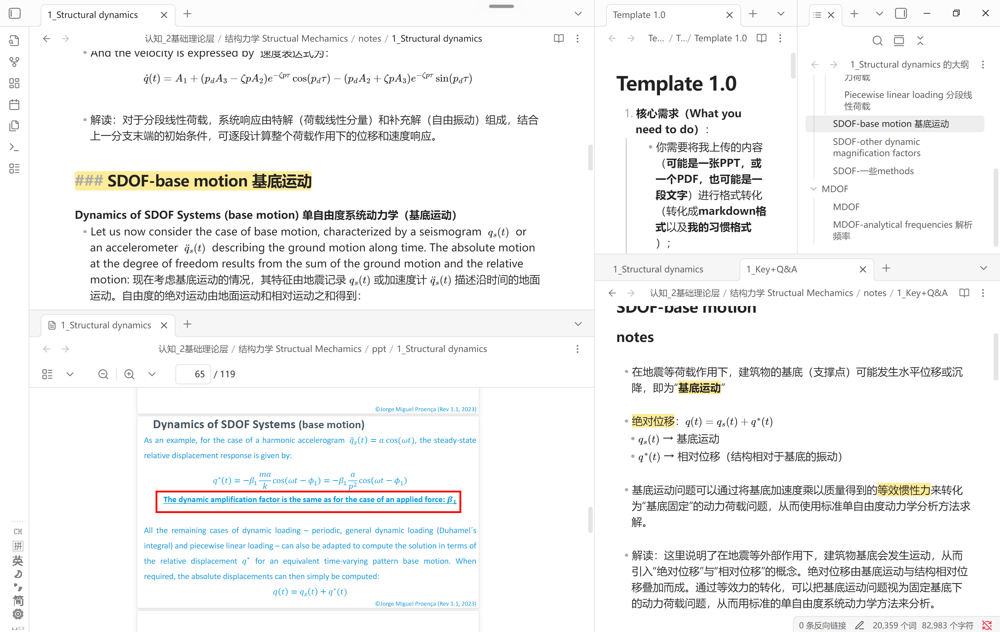
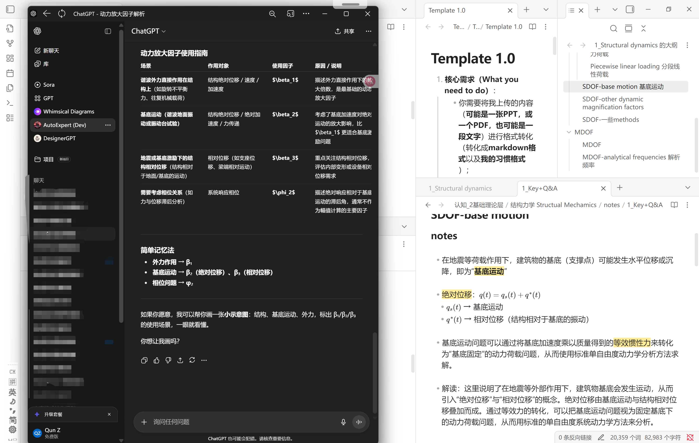

一个英语不好的鼠鼠却要上全英课（且是有口音的外教）的自救指南  
欢迎继续补充，互帮互助！！！

> 注意：这只是一个辅助工具，切勿本末倒置（花太多时间在一个工具上面）

### 目前功能：

> 进行**解读**和**翻译**和**格式转化-数学符号渲染**和**格式转化-图片**  
> 调用mineru，进行**图片截取**

### 效果展示：

	

### 食用方法：

- 如果你手上没有课件，资源只有上课拍的PPT：
	1. 手机电脑同时下载“微信输入法”，实现手机电脑信息互传
	2. 手机上将Prompt喂给豆包/GPT，再把照片喂给豆包/GPT，把结果复制给电脑
	3. 电脑用支持markdown的笔记软件渲染（首推Obsidian！本地存储+分屏功能非常适合知识库搭建）
- 如果在课前你已经有课件资源，可以用mineru的图片分割，截取功能增强你的笔记

> 建议搭配Obsidian使用
> 1. 左侧：**“信息位”**（ppt 或 ppt翻译解读 或 ChatGPT）
> 2. 右上侧：**“工具位”**（Template/Prompt & 大纲定位导航）
> 3. 右下侧：**”工作区“**

	

	

### 功能增强：

1. 图片分割，截取功能
	- 有条件的话（6GB+ VRAM； 32GB+RAM；SSD recommended  20GB+）可以本地部署mineru（避免排队问题）  [https://github.com/opendatalab/mineru](https://github.com/opendatalab/mineru)
	- 用于提取文字和图片截取（不做格式调整和“解读”），然后把结果作为input，输入online的GPT模型（性能更强，理解更好）

### 可能遇到的问题：

- 大模型上下文token限制，一次性不要传太多内容，否则部分内容可能质量不高。

### 后续发展

由于这个工具设计的初衷是全英课程辅助&知识库管理，因此后续主要有两个发展方向：
  - 方向1：（轻量级场景，如课上的一张照片）
    - 以“快”“准”为主
    - （done！）
  - 方向2：（课前，长文本）
    - 以“一键式” “性能稳”为主
    - （todo：解决“上下文token的限制”问题。一个比较简单的，可能实现的方式是文本切分+n8n等工具实现一键式生成）
> 就是由于“上下文token的限制”问题，可能对于大文件它输出的效果不是很好。目前是对于1500以内token，它的效果比较出色。

